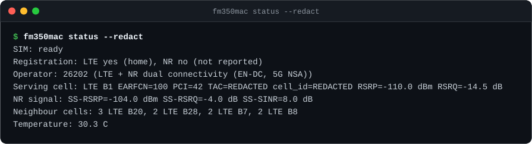
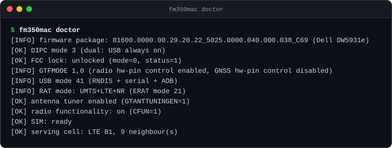
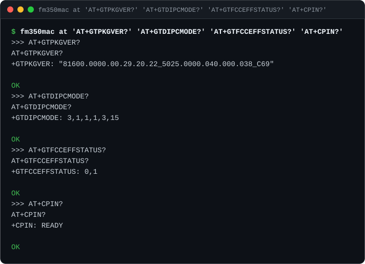
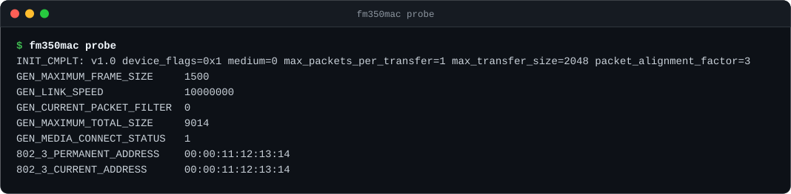
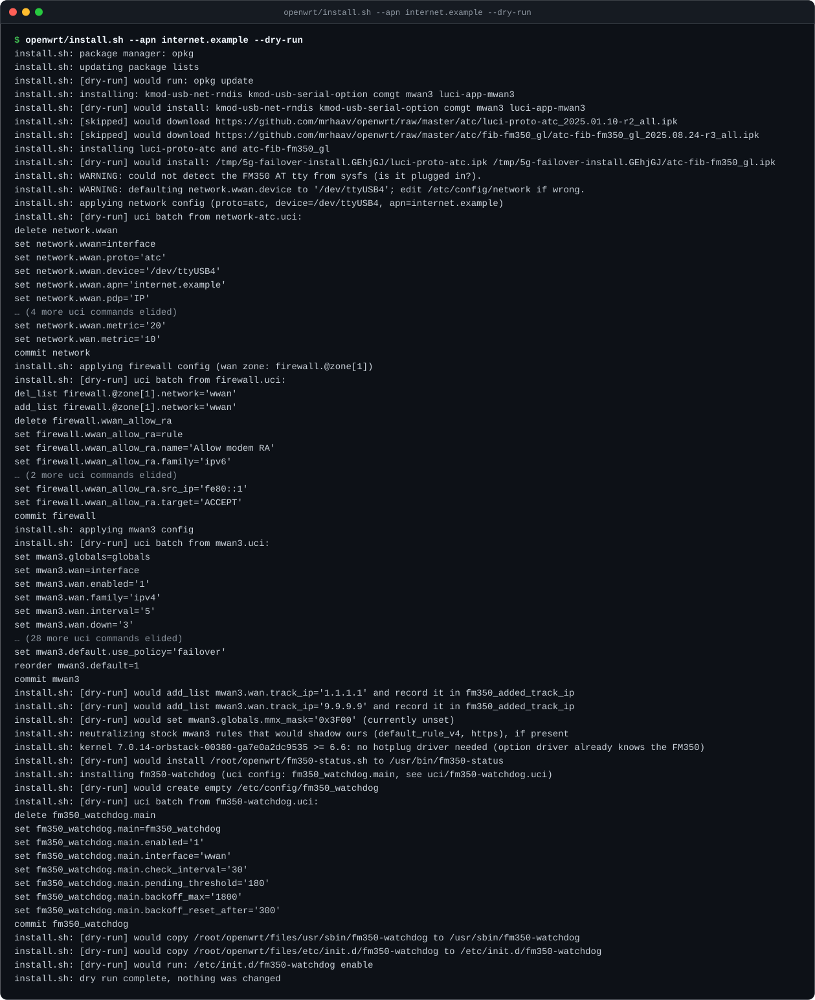
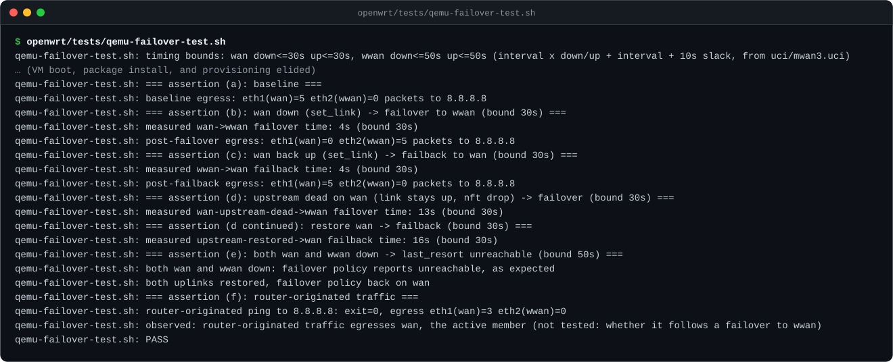
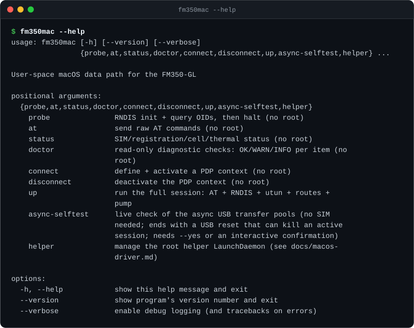

# fm350-usb

[](https://github.com/sebastianspicker/fm350-usb/actions/workflows/ci.yml)
[](LICENSE)
[](#whats-in-the-repo)
[](https://sebastianspicker.github.io/fm350-usb/)

This repository holds tools and notes for running a **Fibocom FM350-GL** 5G modem over USB as a backup internet connection for a home router. That includes the **Dell DW5931e**, the Dell-branded version of the same module that comes out of Latitude laptops and turns up cheaply as a used part. You fit the module into a USB-to-M.2 adapter, plug it into a router (or a Mac, for bench testing), and it can take over the internet connection when your main line goes down.

The repo has three parts:

- **OpenWrt failover:** scripts that set up the modem as a second WAN on an OpenWrt router and switch traffic to it with `mwan3` when the wired line goes down.
- **`fm350mac`:** a user-space macOS driver. macOS has no driver for the modem's RNDIS network interface, so this talks to it over libusb and hands packets to a `utun` interface.
- **Dell DW5931e field guide:** what the Dell OEM firmware changes, how to reach the module's internal root shell, and how to switch it out of "PCIe Advance Mode" (a DIPC mode setting), which AT commands refuse to do.

**Interactive demo:** https://sebastianspicker.github.io/fm350-usb/

## In short

- A DW5931e / FM350-GL enumerates over USB in the Waveshare adapter with no flashing or unlock needed — that's what we found on the one unit tested, 2026-09-25 [Dell guide, TL;DR].
- If the modem hears no cells at all, check the antenna pigtails before anything else. We lost a day chasing firmware causes; the pigtails were the actual problem [Bench log].
- What's proven vs not: USB enumeration, AT access, ADB, SIM detection and LTE registration are verified on real hardware; a real cellular data session works on macOS (`fm350mac up`, Telekom DE, 2026-10-05: ping, HTTPS and a 1 MB download, routed per host with `--route-host`); router failover is verified only in emulation (Docker, a modem emulator, QEMU); throughput hasn't been benchmarked yet.
- Not sure where to start? See "Start here" below.

## Start here: pick your goal

| Your goal | Go to |
|---|---|
| Set up failover on an OpenWrt router | [Setup guide](docs/setup-guide.md), then [openwrt/README.md](openwrt/README.md) |
| Check whether your module is a Dell DW5931e and get it working over USB | [Dell guide](docs/dell-dw5931e-usb.md) |
| Diagnose a problem safely | [Diagnostics](docs/diagnostics.md) |
| Bench-test on a Mac before it goes on the router | [fm350mac README](fm350mac/README.md), [macOS design notes](docs/macos-driver.md) |
| Decide whether to buy the hardware | [Hardware](docs/hardware.md), [Compatibility and risks](docs/compatibility-and-risks.md) |

## Status

We tested this on one module on 2026-09-25.

| What | Status |
|---|---|
| USB 3 enumeration through the adapter, AT access, ADB | Verified on hardware |
| SIM detection, LTE registration (Vodafone DE, band 1) | Verified on hardware |
| Router scripts (install, uninstall, failover, failback) | Verified in Docker, a modem emulator, and OpenWrt 24.10.8 under QEMU |
| `fm350mac` data path | Verified in loopback mode (fake modem); 327 unit tests (2026-09-26) |
| Cellular data session (macOS, `fm350mac up`) | Verified on hardware 2026-10-05 (Telekom DE, LTE B3): ping, HTTPS, 1 MB download over `--route-host` routes |
| Throughput (iperf3, macOS) | First capped runs 2026-10-05 (LTE B7, RSRP −102 dBm, 5 MB per test): 20.4 Mbit/s down, 13.8 Mbit/s up (peak 26 Mbit/s), driver at ~9% CPU. Short runs, dominated by TCP slow start, not a capacity figure |
| 5G NR | The cell offers EN-DC (5G NSA) and the modem measures an NR carrier; no NR data yet |

## What's in the repo

### OpenWrt failover ([`openwrt/`](openwrt/))

On a router running vanilla OpenWrt 24.10 or newer:

```sh
scp -r openwrt root@192.168.1.1:/root/
ssh root@192.168.1.1
cd /root/openwrt
./install.sh --apn <your-apn> --dry-run   # show the uci changes first
./install.sh --apn <your-apn>
```

This installs the FM350 protocol handler (mrhaav's `atc`, or modemfeed's `xmm` with `--proto xmm`), adds a `wwan` interface, and sets up an `mwan3` failover policy. It keeps your existing mwan3 settings: the stock catch-all rules get pointed at the failover policy, and `uninstall.sh` puts them back. It also installs a small watchdog that restarts `wwan` if the protocol handler gets stuck (a known `atc.sh` bug); `--no-watchdog` skips it. `fm350-status` shows decoded signal and cell info on the router.

In the QEMU test (with the earlier, more aggressive mwan3 settings: `wan` down/up 3/3), traffic moved to the modem 5 s after the wired link dropped and came back 4 s after it returned. When the link stayed up but the upstream died, it took 13 s and 16 s — the [openwrt README](openwrt/README.md#failover-end-to-end-testsqemu-failover-testsh) gives a tighter bound of 12–13 s for the same test; the difference is rounding, not a second measurement. The current defaults (`wan` down 5 / up 10) trade speed for fewer false failovers onto a metered SIM: expect roughly 25 s to fail over and 50 s to fail back on a dead upstream (calculated, not yet re-measured).

We built it for a GL.iNet Flint 2 (GL-MT6000). Nothing in it is specific to that router, but we haven't tried it on others. GL.iNet's stock firmware doesn't recognise the FM350; see [docs/compatibility-and-risks.md](docs/compatibility-and-risks.md). Full walkthrough: [docs/setup-guide.md](docs/setup-guide.md).

### `fm350mac`: macOS driver ([`fm350mac/`](fm350mac/))

```sh
brew install libusb
cd fm350mac && uv sync
uv run fm350mac status --redact        # SIM, registration, signal, cells (no root)
uv run fm350mac doctor                 # read-only checks for OEM/Dell modules
uv run fm350mac at 'AT+GTPKGVER?'      # raw AT commands (no root)
```

It's pure Python with a small ctypes binding to libusb, and has no kext or system extension. The part that needs root (creating the `utun` interface and routes) runs in a separate helper installed as a LaunchDaemon, so the driver itself runs as your user. See [fm350mac/README.md](fm350mac/README.md) and the design notes in [docs/macos-driver.md](docs/macos-driver.md).

If you only want an AT prompt, [`tools/fm350_at.py`](tools/fm350_at.py) works on its own:

```sh
uv run --with pyusb tools/fm350_at.py 'ATI' 'AT+CPIN?'
```

### Dell DW5931e guide ([`docs/dell-dw5931e-usb.md`](docs/dell-dw5931e-usb.md))

If `AT+GTPKGVER?` ends in `_5025…`, you have Dell's firmware. The short version:

- It already works over USB in an adapter. Dell's mode only turns USB off when the module has a live PCIe link.
- The mode is a text file on the module's internal Linux system, and the module offers a root shell over ADB. The guide shows how to back the module up and switch the mode safely.
- If the modem hears **no cells at all**, check the antenna pigtails before you touch the firmware. We lost a day to a bad set.

### Diagnostics ([`docs/diagnostics.md`](docs/diagnostics.md))

```sh
python3 tools/fm350_diag.py read          # read-only: checks, 60 s of cell sampling, a report with next steps
python3 tools/fm350_diag.py plan 2        # show exactly what the higher stages would send
```

Stage 0 only reads. Stages 1–3 repeat the changes we made while debugging our own module, and each asks before it changes anything. Read the safety note in the doc first.

## Screenshot tour

Every image is real output from our bench, rendered to SVG by [`tools/screenshots.py`](tools/screenshots.py). IMEI, IMSI, ICCID, serial number, and the serving cell's ID and TAC are redacted.

**`fm350mac status --redact`**: SIM, registration, operator and access technology (here LTE with 5G NSA), serving cell with signal strength, the NR carrier, neighbour cells by band.



**`fm350mac doctor`**: the checks from the Dell guide in one read-only run, with one OK/WARN/INFO line each.



**Identity check**: firmware image (`_5025` = Dell), DIPC mode, FCC lock and SIM, in one AT round trip.



**`fm350mac probe`**: RNDIS initialisation and device queries over libusb, no root needed.



**`install.sh --dry-run`**: every `uci` change the router installer would make, run inside an OpenWrt 24.10 container.



**`qemu-failover-test.sh`**: OpenWrt 24.10.8 under QEMU with real mwan3. It fails over when the wired link drops or the upstream dies, fails back, and handles both links down.



**`fm350mac --help`**: every subcommand.



## Hardware we used

| Part | Notes |
|---|---|
| Fibocom FM350-GL (Dell DW5931e) | MediaTek T700, M.2 3052, firmware 29.20.22. USB ID `0e8d:7127` |
| Waveshare USB TO M.2 B KEY (SKU 23252) | USB 3 to M.2 B-key adapter with a nano-SIM slot and 4 SMA connectors. Waveshare doesn't list the FM350 as supported, but it worked |
| 4 antennas + MHF4-to-SMA pigtails | Buy decent pigtails. Ours were the problem |
| GL.iNet Flint 2 (GL-MT6000) | Router; USB 3 port, 5 V / 2 A |

Specs, power budget and band support are in [docs/hardware.md](docs/hardware.md).

## Documentation

| Document | What's in it |
|---|---|
| [docs/setup-guide.md](docs/setup-guide.md) | Step-by-step bring-up on OpenWrt, from `lsusb` to a working failover |
| [docs/dell-dw5931e-usb.md](docs/dell-dw5931e-usb.md) | Dell DW5931e over USB: DIPC mode, ADB, backup, troubleshooting |
| [docs/diagnostics.md](docs/diagnostics.md) | `tools/fm350_diag.py`: automatic diagnostics in stages, from read-only to the changes we tested, with safety notes |
| [docs/compatibility-and-risks.md](docs/compatibility-and-risks.md) | What's proven, what isn't, FCC lock, GL.iNet firmware support |
| [docs/at-commands.md](docs/at-commands.md) | FM350 AT command cheat sheet |
| [docs/hardware.md](docs/hardware.md) | The three parts, power, antennas, bands |
| [docs/macos-driver.md](docs/macos-driver.md) | How `fm350mac` works and why it's built that way |
| [docs/firmware-reflash.md](docs/firmware-reflash.md) | Untested reflash procedure for OEM units that won't register |
| [docs/bench-log.md](docs/bench-log.md) | Dated lab notes with every measurement |
| [docs/sources.md](docs/sources.md) | References |
| [docs/glossary.md](docs/glossary.md) | Plain-language definitions of every technical term used in these docs |

## Development

```sh
cd fm350mac && uv run pytest -q && uvx ruff check .     # macOS driver
shellcheck openwrt/*.sh openwrt/tests/*.sh               # router scripts
tools/tests/bench-throughput-test.sh                     # benchmark failure handling (no hardware)
openwrt/tests/docker-test.sh                             # install/uninstall in an OpenWrt rootfs (Docker)
openwrt/tests/atc-test.sh                                # protocol handler against a fake FM350
openwrt/tests/qemu-failover-test.sh                      # real mwan3 failover in OpenWrt under QEMU
python3 tools/screenshots.py                             # regenerate the README screenshots
```

## Not affiliated

This is an independent project, not affiliated with or endorsed by Fibocom, Dell, MediaTek, Waveshare or GL.iNet. Changing modem configuration can make a module unusable. The guides say what we did on our unit and what happened, and that's all we can promise.

## Contributing and security

Reports from other modules, firmware and adapters are welcome: open an issue with the **Hardware report** template, using redacted output only. Report security problems privately; see [SECURITY.md](SECURITY.md).

## License

[MIT](LICENSE)

## Glossary

Terms used on this page, defined in the [shared glossary](docs/glossary.md): [ADB](docs/glossary.md#adb), [AT command](docs/glossary.md#at-command), [Cell ID / TAC](docs/glossary.md#cell-id--tac), [DIPC mode](docs/glossary.md#dipc-mode), [EN-DC / 5G NSA](docs/glossary.md#en-dc--5g-nsa), [Failover / failback](docs/glossary.md#failover--failback), [IMEI / IMSI / ICCID](docs/glossary.md#imei--imsi--iccid), [libusb](docs/glossary.md#libusb), [mwan3](docs/glossary.md#mwan3), [OEM image](docs/glossary.md#oem-image), [PDP context / data session](docs/glossary.md#pdp-context--data-session), [QEMU / Docker](docs/glossary.md#qemu--docker), [RNDIS](docs/glossary.md#rndis), [uci](docs/glossary.md#uci), [utun](docs/glossary.md#utun), [Watchdog](docs/glossary.md#watchdog).
